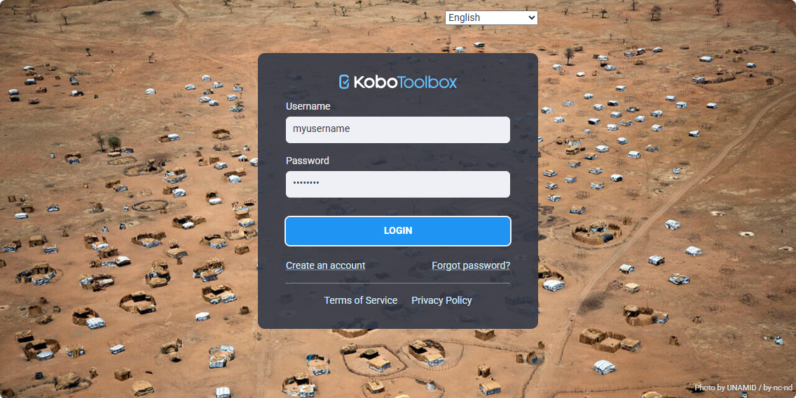
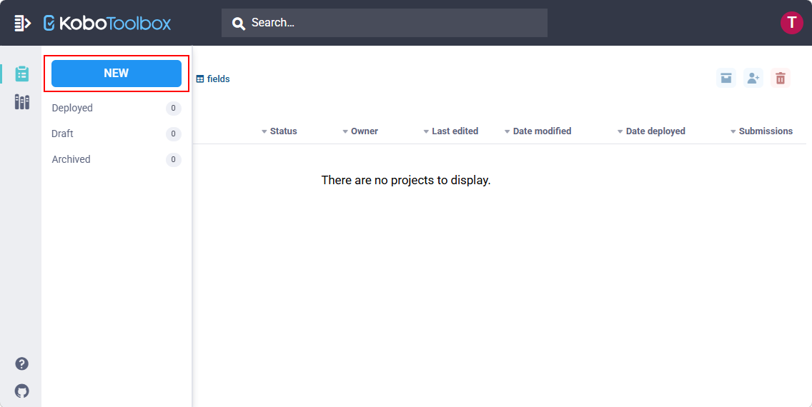

# Form kit

Ready-made survey forms for [CyberTracker](https://cybertracker.org), built on the [XlsForm](https://xlsform.org) standard and the [CyberTracker XlsForm extensions](https://cybertrackerwiki.org/xlsform/). Each form is a complete data capture experience that a project can copy, customize, and deploy to [KoBoToolbox](https://kobotoolbox.org), [ODK Central](https://getodk.org) or [Survey123](https://survey123.arcgis.com).

User documentation lives on the wiki: [cybertrackerwiki.org/xlsform/formkit](https://cybertrackerwiki.org/xlsform/formkit).

| Form | Designed for | How data is entered |
| ---- | ------------ | ------------------- |
| [icon-wildlife](forms/icon-wildlife/) | Rapid counts from a moving aircraft or vehicle, on a tablet | Tap large icons. Location is captured at the moment of the tap. |
| [talk-sheep](forms/talk-sheep/) | Hands-free, eyes-free counts, for example along a transect | Speak. The app records, transcribes and parses each utterance into a record. |

> **Note:** the data model works with every XlsForm backend, but CyberTracker is required on the device. The custom screens are CyberTracker extensions.

## Layout

```
forms/<name>/
  form.xlsx          what is collected: fields, choice lists, settings
  title.qml          home screen
  metadata.qml       session setup
  collect.qml        the capture screen (icon grid, voice recorder, ...)
  media/             icons and images named in the spreadsheet
  README.md          what the form records and what to change
build/<name>/        generated: finalized form.xlsx + flat media, ready to upload
formkit/             the build tool (Python package, `formkit` command)
tests/               builds every form and checks the output
```

Every form is self-contained on purpose. It carries its own copy of its screens, so copying a form and customizing it can never break another one. The spreadsheet names its screens in the `bind::ct:content.qmlFile` column and the build embeds them.

## Quick start

```bash
git clone https://github.com/CyberTrackerConservation/formkit.git
cd formkit
python3 -m venv .venv && source .venv/bin/activate
pip install -e ".[dev]"

formkit list                      # forms in the repo
formkit build                     # build every form into build/
formkit build icon-wildlife       # build one form
formkit validate                  # static checks without building
formkit dump talk-sheep           # print the spreadsheet as Markdown tables
pytest                            # build everything and check it
```

The build embeds the screens into the spreadsheet (compressed and base64-encoded into a `bind::ct:content.qmlBase64z` column), copies the media, and validates the result with [pyxform](https://github.com/XLSForm/pyxform). With `java` on the PATH, pyxform also runs ODK Validate.

Upload `build/<name>/form.xlsx` and every other file in that folder to your backend. The steps for KoBoToolbox are below. ODK Central and Survey123 have their own upload screens but need the same files.

## Using a form with KoBoToolbox

[KoBoToolbox](https://kobotoolbox.org) is free and works well with CyberTracker. You need a built form (see above) and a KoBoToolbox account.

### 1. Log in
Sign in at [kobotoolbox.org](https://www.kobotoolbox.org/). If you do not have an account, create one first. Note which server you signed up on, because CyberTracker will ask for it later.



### 2. Create a new project
Click **NEW** and give the project a name. Do not add questions here. The form comes from the spreadsheet in the next step.



### 3. Open the FORM tab
Open the project and select the **FORM** tab.


### 4. Upload the built spreadsheet
Click **Replace form**, choose **Upload an XLSForm**, and browse to `build/<name>/form.xlsx`. Use the file in `build/`, not the one in `forms/`. The one in `forms/` names its screens by file name and will not work on the device.


> **Do not edit the form in the KoBoToolbox form builder.** The builder does not show the CyberTracker columns and saving from it removes them. Make changes in the spreadsheet, rebuild, and repeat this step.

### 5. Upload the media
If the `build/<name>/` folder contains icons or images, open **SETTINGS**, then **Media**, and upload every file in that folder except `form.xlsx`. File names must match the `media::image` column in the spreadsheet exactly. A form with no media can skip this step.


### 6. Deploy
Click **DEPLOY**. When you change the form later, upload the new `form.xlsx` with **Replace form** again and click **REDEPLOY**.


### 7. Connect CyberTracker
Install CyberTracker on the device from the [download page](https://cybertrackerwiki.org/xlsform/download). Open the app, tap the **+** button, choose **KoBoToolbox**, pick your server, and sign in. Your projects are listed. Tap the form to download it and its media, then tap it again to start.

<table>
<tr>
<td></td>
<td></td>
<td></td>
</tr>
</table>

Data collected on the device is uploaded with **Submit** and appears under the project's **DATA** tab.

## Making your own form

1. Copy the closest existing form folder under `forms/` and give it a new name.
2. Open `form.xlsx` and change the choice lists and fields. The form's README says which rows and columns its screens depend on.
3. Put icons in `media/` and name them in the `media::image` column. Icons come from [wildlifeicons.org](https://wildlifeicons.org).
4. Change the screens if the form needs different behaviour. They are ordinary QML files in the same folder.
5. Run `formkit build <name>` and fix anything it reports.

An AI coding assistant can do steps 2 to 5 from a description. See [CLAUDE.md](CLAUDE.md).

## History

This repository merges the former `aerialsurvey` and `talksurvey` repositories. MIT licensed. Built on CyberTracker, XlsForm, KoBoToolbox, ODK and Survey123, with thanks to the field teams who tested these forms in the air and on the ground.
