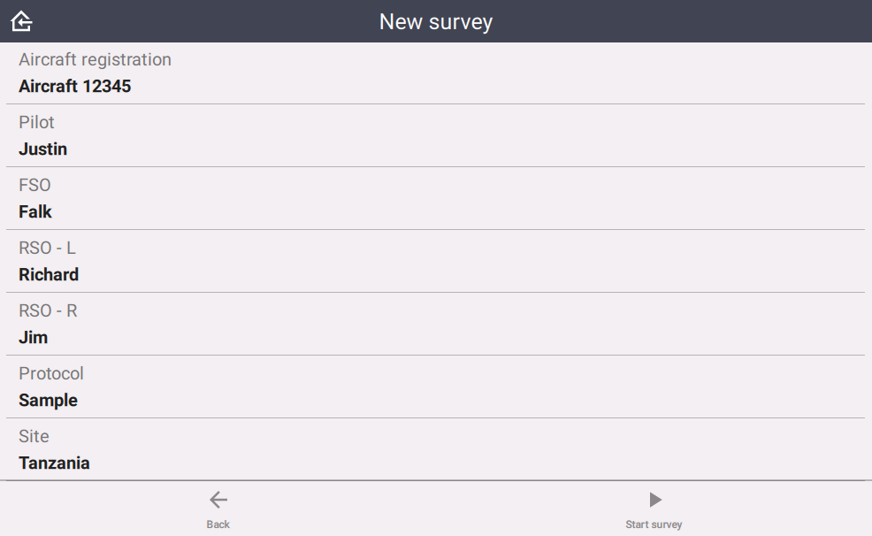
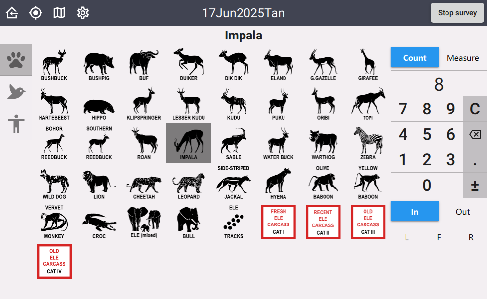
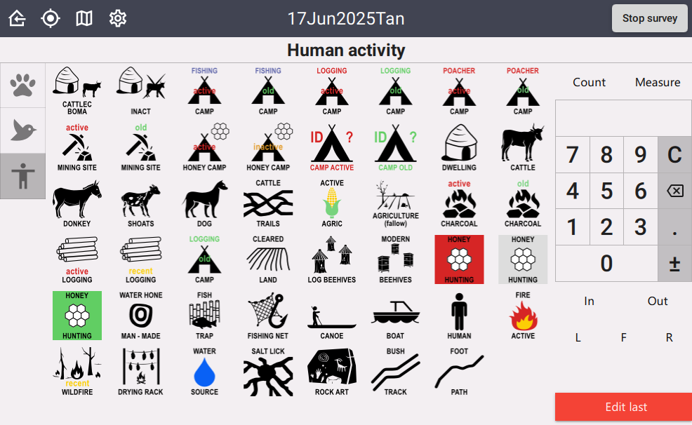

# Aerial wildlife survey

Rapid, icon-based data capture for observers who must record what they see, how many, and where, with minimal attention diverted from the field. Built for tablets in a light aircraft. Developed with WCS field teams as a wildlife, bird and human-activity count. Formerly the `aerialsurvey` repository.

<table>
<tr>
<td></td>
<td></td>
<td></td>
</tr>
</table>

## What the observer sees

1. **Metadata.** Before a session starts, the observer enters the aircraft registration, pilot, front seat observer, left and right rear seat observers, protocol and site. A `mission_id` is derived from the date and site. These are attached to every observation.
2. **Icon grid.** The collect screen shows large icon buttons grouped by category (wildlife, birds, human activity). Tapping one records an observation stamped with the current GPS location. Column count and icon size are set on the spreadsheet so the layout can be tuned to the device.
3. **Correction.** After the first observation, a red button in the corner lets the previous observation be corrected.
4. **Track.** The GPS track is logged for the whole session and attached to the `Stop` record as a zipped GeoJSON file.
5. **Stop and submit.** **Stop survey** closes the session. **Submit** on the home screen uploads to the backend.

## What it records

- **Per session:** aircraft registration, pilot, FSO, RSO left, RSO right (each from the `employee` list with an "other" text fallback), protocol, site, mission id.
- **Per observation:** category, type (filtered by category), measure type and value, in or out, direction.

## Records

Every session writes a sequence of records, distinguished by the `type` field.

| `type`  | Created when | Contains |
| ------- | ------------ | -------- |
| `Start` | **Start survey** | Session metadata and starting location |
| `Data`  | Each icon tap | The observation fields, plus a copy of the metadata |
| `Stop`  | **Stop survey** | Final location and the GPS track as zipped GeoJSON |

The track is written by the `bind::ct:trackFile` setting, and its density is controlled by `locationTrackDistance` and `locationTrackInterval`.

## What a project is expected to change

Only these lists on the `choices` sheet:

| List | Purpose |
| ---- | ------- |
| `employee` | Team members offered in the pilot and observer fields |
| `observation_category` | Top-level groups shown as tabs on the icon grid |
| `observation_type` | The icons. Each row names its `category` and its `media::image` file |

Changing anything else means checking the screens, which name some fields directly (see below).

## Files

| File | Attached to | Notes |
| ---- | ----------- | ----- |
| `form.xlsx` | | The XlsForm. Sheets: `survey`, `choices`, `settings`. |
| `title.qml` | `type` | Home screen. Uses `wcs.svg` as a watermark. |
| `metadata.qml` | `location` | Session setup. Lists the metadata field names in `filterFieldUids`, sets `mission_id`, then skips to `observation_category`. |
| `collect.qml` | `observation_category` | The icon grid. Reads `bind::ct:content.columns`, `itemHeight` and `style` from that row. |
| `media/` | | 120 icons plus `wcs.svg`. Most are also on [wildlifeicons.org](https://wildlifeicons.org) under the `Aerial` source, though some names differ there because parentheses were stripped on import. |

## What the screens depend on

**survey sheet**

| Row | Type | Required columns |
| --- | ---- | ---------------- |
| `survey_id`, `track_file`, `datetime` | `text`, `file` (`parameters` = `format=geojson`), `datetime` | `appearance` = `hidden` |
| `type` | `text` | `bind::ct:content.qmlFile` = `title.qml`, `header.hidden` and `footer.hidden` = `yes`, `content.frameWidth` = `0` |
| `location` | `geopoint` | `bind::ct:content.qmlFile` = `metadata.qml`, same hidden header and footer |
| metadata fields | any | Between `location` and `observation_category`. Names must match `filterFieldUids` in `metadata.qml`. |
| `observation_category` | `select_one observation_category` | `bind::ct:content.qmlFile` = `collect.qml`, `content.style` = `IconOnly`, `content.columns`, `content.itemHeight`, `content.lines` = `no` |
| `observation_type` | `select_one observation_type` | `choice_filter` = `category=${observation_category}` |
| `measure_type`, `measure`, `in_out`, `direction` | `select_one`, `decimal`, `select_one`, `select_one` | |

**choices sheet**: columns `list_name`, `name`, `label`, `media::image`, `category`. Every `observation_type` row names its `observation_category` in `category` and an icon in `media::image`.

**settings sheet**: `namespaces` = `ct="http://cybertracker.org/xforms"`, `bind::ct:icon` = `wcs.svg`, `bind::ct:immersive` = `yes`, `bind::ct:trackFile` = `track_file`, `bind::ct:summaryIcon` = `observation_type`, `bind::ct:summaryText`, `bind::ct:locationTrackDistance`, `bind::ct:locationTrackInterval`.

## Icons

One icon per observation type, SVG preferred. Colour convention for state variants:

| State | Colour |
| ----- | ------ |
| Active | `#d62525` |
| Recent | `#61ce63` |
| Old | `#e29b29` |

## Hardware

Tablet, Android 9+ or iOS 13+, screen of 8 inches or more at 1920×1200 or better, built-in GPS, 6+ hours battery, 16 GB free. Bright or anti-reflective screens help in daylight. Phones work but the icons become small.

## Build

```bash
formkit build icon-wildlife
```

Upload `build/icon-wildlife/form.xlsx` and every icon in that folder to the backend.
